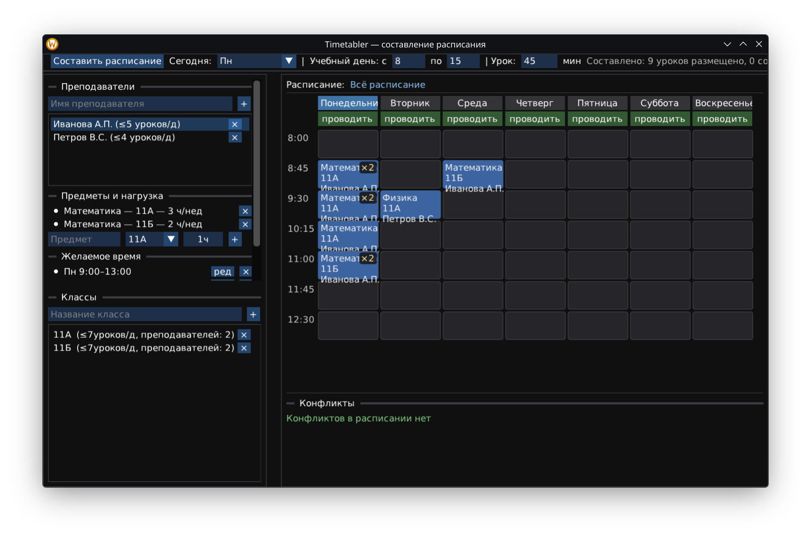

# Timetabler

An automatic schedule builder for teachers.

The app takes teachers and their preferences as input: subject, class and weekly hours, plus desired time slots (days and hour ranges). Based on this data it automatically places lessons on a weekly grid, respecting teacher and class occupancy, daily lesson limits, disabled days and the current school day.

If a lesson cannot be placed into a desired slot, the program shows the reason in the conflicts panel. The result can still be edited by hand - drag & drop moves lessons, while the right-click menu locks, unlocks or cancels them.

## Screenshots




## Ubuntu dependencies

For ImGui with GLFW backend the following packages must be installed
```
libx11-dev libxrandr-dev libxinerama-dev libxcursor-dev libxi-dev freeglut3-dev
```

## Credits

- Dear ImGui
- GLFW
